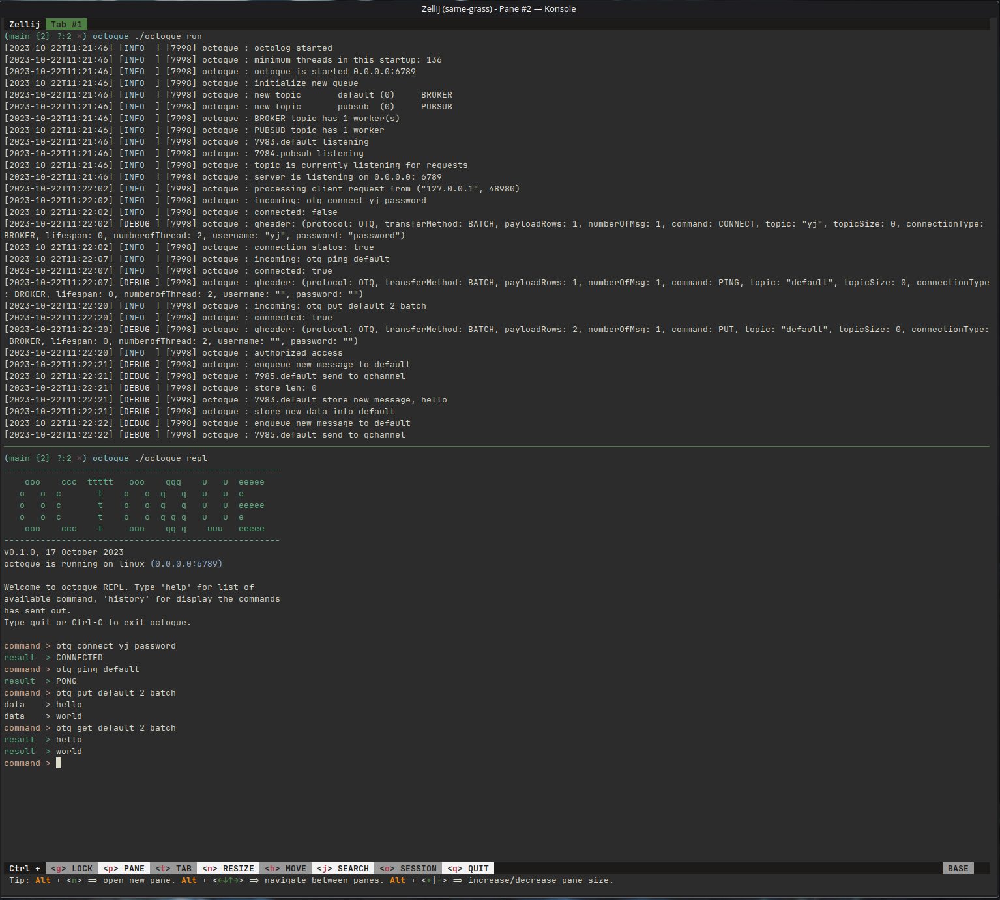

## Getting started guide

octoque currently is in active development and only support for linux. The getting started guide will be heavily depends on linux only.

### Pre-requiste

- nimlang 2.0, if you have not installed nim, you can follow it [here](https://nim-lang.org/install_unix.html)

- [octolog](https://github.com/jaar23/octolog) (another project of mine, to allow logging in multi thread application)

- `libsodium` is required for the authentication feature, you can install it by

  fedora
  ```shell
  sudo dnf install libsodium -y
  ```

  RHEL 9

  ```shell
  subscription-manager repos --enable codeready-builder-for-rhel-9-$(arch)-rpms

  dnf install https://dl.fedoraproject.org/pub/epel/epel-release-latest-9.noarch.rpms

  sudo yum install libsodium -y
  ```
  
  AlmaLinux 9, Rocky Linux 9

  ```shell
  dnf config-manager --set-enabled crb

  dnf install epel-release
  
  sudo dnf install libsodium
  ```
  
  RHEL 8

  ```shell

  subscription-manager repos --enable codeready-builder-for-rhel-8-$(arch)-rpms
  
  dnf install https://dl.fedoraproject.org/pub/epel/epel-release-latest-8.noarch.rpm

  sudo yum install libsodium -y
  ```

  ububtu / deb based distro
  ```
  sudo apt-get update -y

  sudo apt-get install -y libsodium-dev
  ```
  
  macos
  
  ```shell
  brew install libsodium
  ```

### Installing

building from source is the only method for now.

```shell
git clone https://github.com/jaar23/octoque.git

cd octoque

nimble build

chmod +x octoque
```

### Running the application

you can place `octoque` binary to an excutable folder `(/usr/local/bin)` or adding it to the environment variable or running it directly by

```
./octoque run
```
Example



view more option by running

```shell
## all command
./octoque -h

## run command
./octoque run -h

## administrative command
./octoque adm -h

## repl command
./octoque repl -h
```
There are always two queue topic by default `default` and `pubsub`. `default` topic is running as a  BROKER connection type while `pubsub` is running as PUBSUB connection type.

A default administrative user will be created on first launched, you can try to connect via `./octoque repl`.

Start REPL mode, then run the command below

```shell
otq connect admin password

otq display *
```

Find out more about [message structure](./message-structure.md)

Find out more about [message command](./message-command.md)
